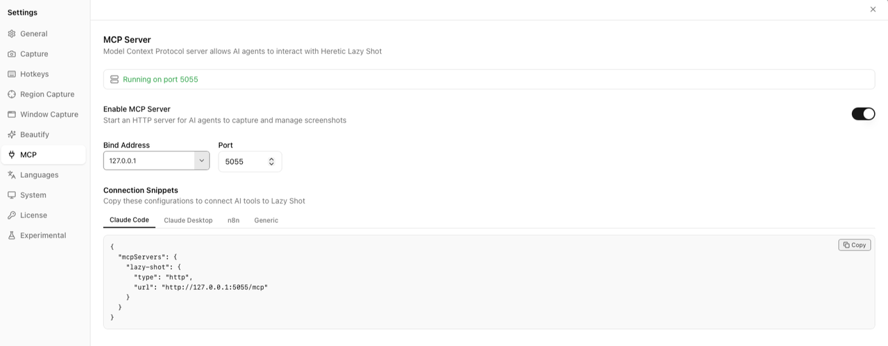
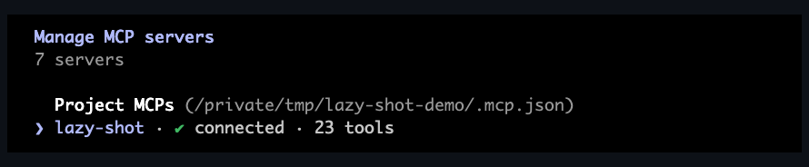

# Asset specification

Ten assets, each with a fixed filename, a fixed size, and a list of what must be visible in it. Produce them in any order; each one is independently droppable — put the file at its path, paste the embed snippet over the placeholder in the target file, done.

Three of them are recordings; their shot lists are at the bottom under [Scenarios](#scenarios).

## The production rule

**Stills** are captured and composed in Lazy Shot itself — that's the dogfood rule, and it's non-negotiable for anything that shows the product.

**Recordings** are made with whatever screen-recording tool you use. Two things matter more than which tool that is:

- What's *on screen* must be Lazy Shot doing real work, not a mockup.
- Lazy Shot's own library and window are the subject, so the recording must show the app's real UI at real speed.

One alternative worth knowing for A2 and A5: instead of recording the screen, export the capture sequence from the library and assemble the frames directly. Every frame is then a genuine library item — the animation *is* the library playing back, which is a slightly purer version of the same argument.

```bash
# frames exported from the library, named 01.png … NN.png, all identical size
ffmpeg -framerate 1 -i %02d.png -vf "scale=1280:-1:flags=lanczos,split[s0][s1];\
[s0]palettegen[p];[s1][p]paletteuse" -loop 0 out.gif
```

## The ten

| ID | File | Type | Size | Length | Appears in |
| --- | --- | --- | --- | --- | --- |
| A1 | `assets/brand/og-1200x630.png` | Still | 1200×630 | — | Social/link previews |
| A2 | `assets/recipes/00-see-what-you-shipped/iteration-series.gif` | Recording | 1280 wide | ~10 s | README hero + recipe 00 |
| A3 | `assets/recipes/01-self-documenting-ui/annotated-flow.png` | Filmstrip | 1280 wide | — | Recipe 01 |
| A4 | `assets/recipes/02-visual-bug-fixing/before-after.png` | Diptych | 1280 wide | — | Recipe 02 |
| A5 | `assets/recipes/03-complex-site-navigation/session-replay.gif` | Recording | 1280 wide | ~10 s | Recipe 03 |
| A6 | `assets/recipes/04-release-day-batch-capture/sweep-grid.png` | Contact sheet | 1280 wide | — | Recipe 04 |
| A7 | `assets/recipes/05-copy-the-uncopyable/ocr-to-markers.png` | Triptych | 1280 wide | — | Recipe 05 |
| A8 | `assets/setup/settings-mcp.png` | Still | 900 wide | — | README setup + SETUP.md |
| A9 | `assets/setup/claude-code-connected.png` | Still | 900 wide | — | SETUP.md |
| A10 | `assets/demo/lazy-shot-cookbook-demo.mp4` | Video | 1920×1080 | 45 s | X thread, product page, Show HN |

GIFs stay under 5 MB, PNGs under 1 MB (WebP if not), the video under 20 MB.

Every asset has a step-by-step scenario in **[scenarios/](../scenarios/)** — stage setup, the prompt to paste, the code to break and fix, and the output to expect. A deliberately broken demo app ships alongside them. The three recordings are also summarised under [Scenarios](#scenarios) below.

---

## A1 — `assets/brand/og-1200x630.png`

**Full scenario: [A1-og-image.md](../scenarios/A1-og-image.md)**

The link preview. Seen more often than the README itself, by people who haven't decided to click yet.

**Must contain:** the cat-in-crosshair icon; the words **Lazy Shot Cookbook**; the line **Give your agent eyes.**; the subline `23 MCP tools · macOS + Windows`. Dark background, the icon's dark red as the accent.

**Produce:** compose in the Compositor at a custom 1200×630 canvas, or in any design tool — this is the one asset that isn't a screenshot of anything.

**Note:** GitHub only uses a repo's social preview if you upload it in Settings → General → Social preview. The file in the repo is the source; uploading it is a separate step.

---

## A2 — `assets/recipes/00-see-what-you-shipped/iteration-series.gif`

**Full scenario: [A2-iteration-series.md](../scenarios/A2-iteration-series.md)**

**The one that matters.** The whole pitch in ten seconds: an agent changing UI code and *looking* at the result until it matches. [Scenario](#a2-scenario--the-agent-converges-10-s).

**Must show:** the same app window at the same size, converging on the goal — misaligned → closer → correct — with the keyword of each capture visible (`hero-iter-1` … `hero-after`) so the naming convention lands without reading a word of text.

**Watch for:** identical window size throughout, or it jitters. Nothing personal in the surrounding chrome.

**Embed** — README, replacing the placeholder under the recipe table, and at the top of recipe 00:

```markdown

```

---

## A3 — `assets/recipes/01-self-documenting-ui/annotated-flow.png`

**Full scenario: [A3-annotated-flow.md](../scenarios/A3-annotated-flow.md)**

**Must contain:** three panels left to right — (1) a raw `capture_window` of a settings dialog, (2) the same shot open in Lazy Shot with numbered markers ①–④ showing on the elements a doc would describe, (3) a fragment of the generated Markdown with numbered captions matching those markers. A thin caption strip under panels 1 and 2 with their keywords (`settings-step-1`, `settings-step-1-markers`).

**Produce:** run the recipe 01 prompt on Lazy Shot's own Settings dialog. Panel 3 is a screenshot of the agent's Markdown output. **Panel 2 is a capture of the app with markers toggled on**, cropped to the canvas — markers are metadata and never appear in the layer's own file ([why](./TOOLS.md#add_markers)). Arrange all three in the Compositor.

**The point it must make:** the marker layer is a *separate file* from the original. Both panels visible side by side, with both keywords legible, is the argument.

**Embed** — recipe 01:

```markdown

```

---

## A4 — `assets/recipes/02-visual-bug-fixing/before-after.png`

**Full scenario: [A4-before-after.md](../scenarios/A4-before-after.md)**

**Must contain:** two panels — left, the broken state; right, the fixed state. Same crop, same scale, only the numbers differ. Labels burned in: `checkout-before` / `checkout-after`. Use a real bug you actually fixed.

**Produce:** both panels are Lazy Shot captures, arranged as a diptych in the Compositor with a visible gutter. No markers — `-€NaN` doesn't need an arrow, and markers wouldn't survive into the file anyway ([why](./TOOLS.md#add_markers)).

**Watch for:** this is the asset most likely to leak something — no order numbers, emails, or customer names. Spoiler (not Blur) anything borderline.

**Embed** — recipe 02:

```markdown

```

---

## A5 — `assets/recipes/03-complex-site-navigation/session-replay.gif`

**Full scenario: [A5-session-replay.md](../scenarios/A5-session-replay.md)**

**Must show:** one real browser flow stepping forward, each step landing in the library as a named capture (`checkout-step-1` … `checkout-step-5`). [Scenario](#a5-scenario--the-flight-recorder-10-s).

**The point it must make:** every step is a named artifact. The keywords carry that; without them this is just a screen recording of a browser.

**Embed** — recipe 03:

```markdown

```

---

## A6 — `assets/recipes/04-release-day-batch-capture/sweep-grid.png`

**Full scenario: [A6-sweep-grid.md](../scenarios/A6-sweep-grid.md)**

**Must contain:** a 3×3 or 4×3 contact sheet of one real release sweep — nine to twelve different windows captured in a single agent run, each tile captioned with its keyword (`v1-4-settings`, `v1-4-editor`, …). Uniform tile size, small gutters.

**Produce:** run the recipe 04 prompt, then arrange the resulting captures as a grid in the Compositor.

**The point it must make:** volume and naming. One command, a dozen named artifacts. Don't crop the captions.

**Embed** — recipe 04:

```markdown

```

---

## A7 — `assets/recipes/05-copy-the-uncopyable/ocr-to-markers.png`

**Full scenario: [A7-ocr-to-markers.md](../scenarios/A7-ocr-to-markers.md)**

The most technically interesting asset in the set — nothing else on the market does this.

**Must contain:** three panels — (1) an unselectable error dialog, captured; (2) the `ocr_screenshot` output as verbatim text, with one low-confidence word visibly flagged; (3) the marker layer open in Lazy Shot, markers toggled on, ①②③ landing precisely on the words the agent was asked about — placed from OCR bounding boxes rather than by eye.

**Produce:** capture a real error dialog, call `ocr_screenshot` with `format: "metadata"`, take the word boxes, feed the centres to `add_markers`. Panel 2 is a screenshot of the tool output. **Panel 3 must be a capture of the app** — markers are metadata and never appear in the layer's own file, so composing panel 3 from that file yields a blank panel ([why](./TOOLS.md#add_markers)). Compositor for the layout.

**The point it must make:** the markers are *derived from* the OCR boxes. Consider a hairline connecting a word in panel 2 to its marker in panel 3 — that single line is the whole idea.

**Embed** — recipe 05:

```markdown

```

---

## A8 — `assets/setup/settings-mcp.png`

**Full scenario: [A8-A9-setup-shots.md](../scenarios/A8-A9-setup-shots.md)**

**Must contain:** the Settings → MCP tab with the server enabled and the port visible. Crop to the panel; no desktop, no other windows.

**Produce:** `capture_window` on Lazy Shot itself, light theme, then trim in the Compositor.

**Watch for:** if your bind address is set to anything other than `127.0.0.1`, reset it before capturing — the security section tells readers to keep it on loopback, and the screenshot shouldn't contradict it.

**Embed** — README step 1 and SETUP.md prerequisites:

```markdown

```

---

## A9 — `assets/setup/claude-code-connected.png`

**Full scenario: [A8-A9-setup-shots.md](../scenarios/A8-A9-setup-shots.md)**

The trust asset: proof the thing connects in one command.

**Must contain:** terminal output of `/mcp` in Claude Code showing `heretic-lazy-shot` connected, with the tool count and the two prompts visible. Real terminal, real output.

**Produce:** screenshot the terminal with `capture_window`, crop to the relevant block.

**Watch for:** other MCP servers in that list, project paths, and anything in the shell prompt you'd rather not publish.

**Embed** — SETUP.md, Claude Code section:

```markdown

```

---

## Scenarios

Shot lists for the three recordings. Each assumes a clean desktop, light theme, no notifications, and a 1920×1080 recording area cropped afterwards.

### A2 scenario — "the agent converges" (10 s)

Layout: split screen. **Left half** the terminal running Claude Code. **Right half** the app window under work, fixed size, never moved.

| Time | On screen |
| --- | --- |
| 0–1 s | Both halves visible, still. The app shows a visibly wrong layout — a card overflowing its container is the clearest defect at small sizes |
| 1–2 s | In the terminal: `capture_window` → `hero-before`, the returned file path visible |
| 2–4 s | The agent edits a CSS/style file. Hot reload repaints the right half — the layout shifts, still not right |
| 4–5 s | `capture_window` → `hero-iter-1`. The agent's own line reads back what still doesn't match |
| 5–8 s | Two more cycles, faster: edit → repaint → `hero-iter-2`, `hero-iter-3`. The right half converges |
| 8–9 s | Final capture → `hero-after`. The agent states the goal is met |
| 9–10 s | Hold on the finished layout with the terminal showing the before/after paths |

The beat that sells it is at 4–5 s: the agent *reads its own screenshot* and says what's still wrong. If only one moment survives cropping, keep that one.

Don't speed-ramp the edits into a blur. The point is that a real loop is short, not that it's magic.

### A5 scenario — "the flight recorder" (10 s)

Layout: **left** browser window, **right** the Lazy Shot library list, visible the whole time.

| Time | On screen |
| --- | --- |
| 0–2 s | Agent acts in the browser (click through to a listing page). A capture lands: a new row appears in the library on the right, keyword `checkout-step-1` |
| 2–6 s | Three more actions, three more rows appearing in sequence — `-step-2`, `-step-3`, `-step-4`. Rows accumulate; nothing is discarded |
| 6–8 s | A step goes wrong: the page shows an unexpected state. The capture still lands, `checkout-step-5` |
| 8–10 s | Cut to the library filtered by `checkout-step` — five rows, in order, with thumbnails. Hold |

The library filling in real time on the right is the entire asset. If the browser action is hard to follow, that's fine — the eye should be on the accumulating rows.

### A10 scenario — the 45-second demo (`assets/demo/lazy-shot-cookbook-demo.mp4`)

For the X thread, the product page, and the Show HN post. Silent, captioned, loopable. Four beats.

| Time | Beat | On screen |
| --- | --- | --- |
| 0–5 s | **The problem** | An agent in the terminal says a UI change is done. The app window beside it visibly disagrees. Caption: *"Agents ship UI changes blind."* |
| 5–12 s | **The setup** | The Settings → MCP toggle, then one line in the terminal: `claude mcp add --transport http heretic-lazy-shot http://localhost:5055/mcp`, then `/mcp` listing the tools. Caption: *"One command. 23 tools."* |
| 12–30 s | **The loop** | The A2 scenario, uncut: edit → repaint → capture → the agent reads the image and says what's still wrong → repeat → done. Caption: *"Now it looks before it says done."* |
| 30–40 s | **The library** | Cut to the library: the `-before`, `-iter-N`, `-after` series with keywords readable. Then `search_screenshots` recalling it by name. Caption: *"Every step, named and searchable."* |
| 40–45 s | **The close** | The cookbook README on screen, repo URL and the one-time price visible. Caption: *"Give your agent eyes."* |

Rules for this one: no voice-over (it gets muted anyway), captions large enough to read on a phone, and the first three seconds must work as a silent autoplay thumbnail — that means the disagreement between "done" and the broken window has to be visible immediately.

Cut A2 out of this video rather than filming it twice.

## House rules for all ten

- **Theme:** light, unless the asset is about dark mode. Light screenshots survive both GitHub themes better than the reverse.
- **Window, not display.** `capture_window` scopes what leaks. Never ship a full-display capture.
- **Redact with Spoiler, not Blur.** Light blur over text is reversible; the cookbook says so, so the assets must obey it.
- **Alt text is mandatory** — the snippets above have it written; use them rather than `![screenshot]`.
- **Captions are part of the asset.** Burn keywords into the image where the spec asks for them. Half of these assets exist to make the naming convention visible.
- **Check the rendered size** on a real GitHub page before committing. A 4 MB GIF above the fold is a bounce.

## Tracking

Placeholders live in the target files as `<!-- TODO(assets): A<n> — … -->`. Grep `TODO(assets)` to see what's still missing and exactly where it goes.
