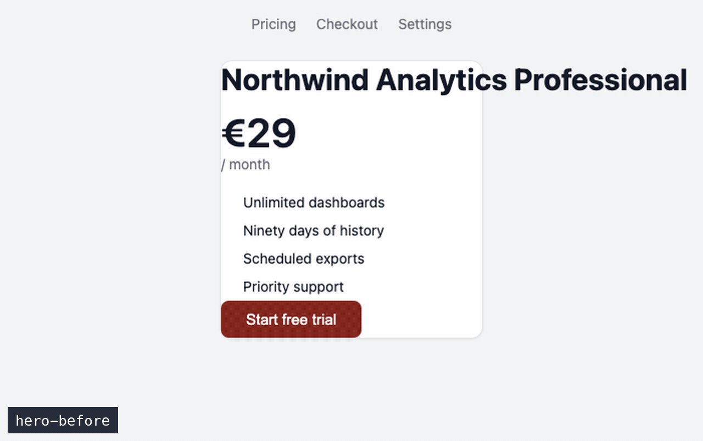

# Recipe 00 — The see-what-you-shipped loop

**Problem:** coding agents ship UI changes blind. "The button should be aligned now" — *should*, because the agent never looked. You become the render farm: run it, screenshot it, paste it back, repeat.

**Idea:** close the loop. The agent edits, the screen updates, the agent captures the window, reads the file, and compares reality against the goal — *before* claiming done. The finish line is a `-before`/`-after` pair in your PR, produced as a side effect.

**The premise, stated honestly:** Lazy Shot never watches your screen. There is no observe-until-something-changes mode; capture is **directed** — the agent shoots exactly what it's told, when it's told, one explicit tool call at a time. Note the flip side while you're here: a capture is silent, with no on-screen indicator, so what you audit is the `[MCP]` lines in the app log, not a visual cue. So this recipe is really about the *protocol*: who puts the right state on screen, and who calls the shot. There are three rungs.



*Four captures, one per iteration: `hero-before` → `hero-iter-1` → `hero-iter-2` → `hero-after`. Shot with the [A2 scenario](../../scenarios/A2-iteration-series.md).*

## The autonomy ladder

**Rung 1 — self-refreshing stage (fully autonomous).**
When the visible state updates itself — a dev server with hot reload (Vite, Next, `tauri dev`), an auto-refreshing dashboard — the agent iterates alone. You participate exactly once: start the dev server, open the screen being worked on, leave the window unminimised. From then on: edit → HMR repaints the same window → `capture_window` by process → read → compare → next edit.

**Rung 2 — state through code, not clicks (still autonomous).**
The agent can't click, but it owns the codebase, and the codebase *is* its hands. Need the error state, the open modal, the empty list? A temporary dev flag, a scratch route, a forced-state render — hot reload swaps the content of the same window, no mouse involved. Remove the scaffolding when done. No HMR at all? The agent's shell still closes the loop: kill → build → run → wait → `capture_window`. Works for desktop and mobile too: edit SwiftUI → build → `capture_window "Simulator"`.

**Rung 3 — stage directions (human as hands).**
Some states only fingers can reach: a native menu, a hover, a third-party OAuth screen. The agent issues a numbered stage direction — "① open Settings → Advanced, ② hover the sync icon — say **go**" — waits for your go, captures. A two-word contract: you act, it shoots and files. ([Recipe 01](../01-self-documenting-ui/) already runs on this pattern for documentation flows.)

The skill of this recipe is *choosing the lowest rung that reaches the state* — and most UI coding lives on rungs 1–2, where "not automatic" stops mattering at all.

## Setup

1. Run the app in dev mode; open the screen under work; fixed window size; don't minimise it.
2. Tell the agent the target once: *"The app is process `myapp` (dev server in terminal 2). Iterate on the visible screen."*
3. Have the drop-in [`CLAUDE.md`](../../CLAUDE.md) in the project — it carries the standing rules below.

## The loop

```text
capture_window "myapp" (keyword "<feature>-before")
        │
        ▼
  edit code ──▶ HMR repaints (or shell: kill/build/run) ──▶ capture_window "myapp"
        ▲                                                        │
        │                    keyword "<feature>-iter-N" ─────────┤
        │                                                        ▼
        └──── not there yet ◀──── read file, compare vs goal ────┤
                                                                 ▼
                                     done ──▶ keyword "<feature>-after"
                                          ──▶ before/after pair into the PR
```

## Copy-paste prompt

```text
UI task: <goal>. The app runs with hot reload as process "<name>".

Protocol:
1. Before your first edit: capture_window query "<name>",
   keyword "<feature>-before".
2. After every change that should be visible: capture_window query "<name>"
   (NEVER capture_active_window — that's this terminal), keyword
   "<feature>-iter-N", read the file, and state explicitly what matches
   the goal and what doesn't yet.
3. You cannot click. To reach another state, prefer code (dev flag,
   scratch route, forced state — remove it afterwards). Only if code
   can't reach it, give me a numbered stage direction and wait for my "go".
4. Never claim done from code alone. Done = the last capture matches the
   goal; keyword it "<feature>-after" and output the before/after file
   paths for the PR.
```

## The iteration series is a free artifact

Every `-iter-N` capture stays in the library: scroll the series and you *watch the agent converge* — useful for debugging a wandering session, delightful in a demo. Housekeep afterwards if you like (`search_screenshots "<feature>-iter"` → soft delete); the `-before`/`-after` pair is the keeper.

## Tools used

`capture_window` · `assign_keyword` · `search_screenshots` · `delete_screenshot` — plus the agent's own shell for builds and dev-server logs (it knows when HMR applied by watching output it already has).

## Gotchas

- **`capture_active_window` is a trap in coding sessions** — the focused window is the terminal the agent lives in. The tool's own description warns about it. Less obviously, **`capture_tracked_window` with `stack_position: 1` is the same trap**: position 1 is "most recently focused", and every shell command the agent runs hands focus back to its terminal. We shot a whole frame of the agent's own transcript this way.
- **Query the window title, not the process name.** `capture_window "Google Chrome"` matches *a* Chrome window — with several open, quite possibly the one with your email in it. The title is specific; the process name is a coin flip. This is the single most common mistake in this workflow.
- **`list_tracked_windows` is history, not a live inventory.** Closed windows keep their row. Two entries with the same title usually means one live window and one ghost — compare `last_seen` before concluding you have a collision. Title matching takes the most recently active match, so the ghost loses.
- **A window that has never been focused is missing from that list entirely** — it's written on focus events. `capture_window` still finds it: that one matches the OS window list. So "not in the tracker" never means "can't be captured". Tabs, on the other hand, are genuinely invisible: the tracker is per window, so give anything you want to name its own window.
- The window must exist on a real, unlocked screen, unminimised, for the whole session. Occluded-window behaviour varies by platform — keep it visible if in doubt.
- Agent vision judges presence, layout, colour and truncation well; it is not a pixel ruler. For "exactly 8px gap" polish, the human eye — or [recipe 06](../06-visual-regression-watch/)'s `magick compare` against a reference render — finishes the job.
- Captures are silent — nothing flashes, nothing pops up. A 15-iteration session leaves 15 images in the library with no visible sign it happened. Convenient while you work, worth knowing about: if you want to see what the agent actually shot, that's `list_screenshots` or the `[MCP]` lines in the log.
- Keyword collisions auto-suffix (`login-1`, `login-1-2`, …); the agent must use the *returned* keywords in its final report.
- **This is the recipe that needs an active licence.** Each iteration is at least one tool call, and the free tier allows ten a day — a real session burns that before lunch. [The quota, in detail](../../docs/SETUP.md#licence-and-the-free-tier-quota).
