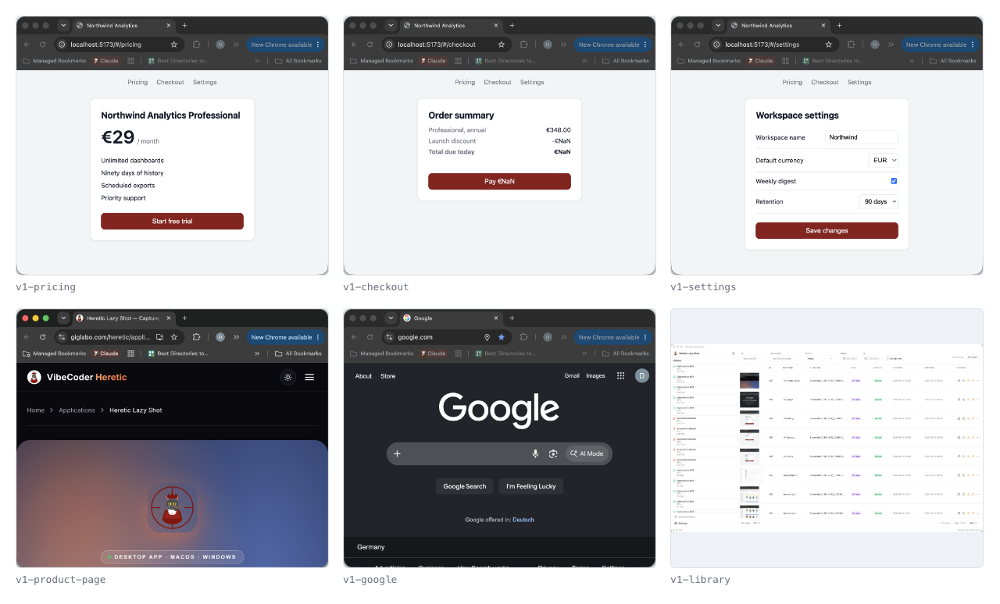

# Recipe 04 — Release-day batch capture

**Problem:** pre-release visual sweeps ("open every screen, eyeball it, screenshot it for the changelog") are exactly the kind of chore that gets skipped when the deadline is real.

**Idea:** the built-in **`batch-capture`** MCP workflow prompt turns the sweep into one agent run: discover recently used windows, capture each, name each.



*One prompt, six named artifacts. Now look at `v1-checkout`: every total reads `€NaN`, including the button you are asked to press. That is what a contact sheet is for — not to be read, but to make you open the one that looks wrong. Shot with the [A6 scenario](../../scenarios/A6-sweep-grid.md).*

## The built-in flow

```text
list_tracked_windows  ──▶  loop: capture_tracked_window (+ keyword)  ──▶  review checklist
```

Prerequisite: enable the **Window Activity Tracker** (Settings → Experimental). It keeps an LRU stack of your recently focused windows, which is what makes "capture everything I touched today" possible.

## Copy-paste prompt

```text
Run a release sweep for v<version>:
1. list_tracked_windows.
2. Show me the list; let me strike anything irrelevant.
3. For each remaining window: capture_tracked_window with keyword
   "v<version>-<app-or-screen-slug>".
4. Output a checklist: keyword → file_path → [ ] looks right, for me
   to review.
```

Every release now has a named, dated, searchable visual snapshot. When a user reports "this looked different in v1.3", `search_screenshots "v1.3"` answers in seconds.

## Every monitor, not every window

For dashboards, wall displays, multi-monitor ops setups:

```text
list_displays, then capture_display for each, with keyword
"daily-<display-name>-<date>".
```

## Turning the sweep into a diffable artifact

Captures alone are a photo album. Add one OCR pass and the sweep becomes greppable:

```text
After the sweep, ocr_screenshot each capture and write
release-notes/v<version>-visible-strings.txt as "keyword: text".
```

Commit that file. Next release, the diff shows every user-visible string that changed — including the ones nobody meant to change, and the ones your i18n pipeline quietly dropped back to English. It's the cheapest release check in this cookbook, and it runs entirely on-device.

## Scheduling it

Any scheduler that can speak MCP over HTTP can run this nightly — self-hosted n8n with an MCP Client node, a cron job driving a headless agent, whatever you already operate. Two constraints are non-negotiable:

- The scheduler must run on the **same machine** as Lazy Shot. Responses are local file paths.
- The machine must be awake and unlocked. A locked screen photographs a lock screen.

[Recipe 08](../08-dashboard-watch/) works through a full scheduled flow, including what to do with the resulting images.

## Tools used

`list_tracked_windows` · `capture_tracked_window` · `list_displays` · `capture_display` · `assign_keyword` · `ocr_screenshot` · `search_screenshots`

## Gotchas

- The Activity Tracker is opt-in and experimental — turn it on before expecting `list_tracked_windows` to return anything.
- Tracked-window capture targets what the tracker *saw*; windows closed since will error. The agent should skip and report, not retry.
- The sweep is silent. A 20-window run produces no visible sign that anything happened, so build the review checklist into the prompt (step 4) — that output is your confirmation the sweep actually ran.
- Sweeps generate volume. Keyword them by version so `search_screenshots` stays useful, and soft-delete old sweeps on a schedule.
